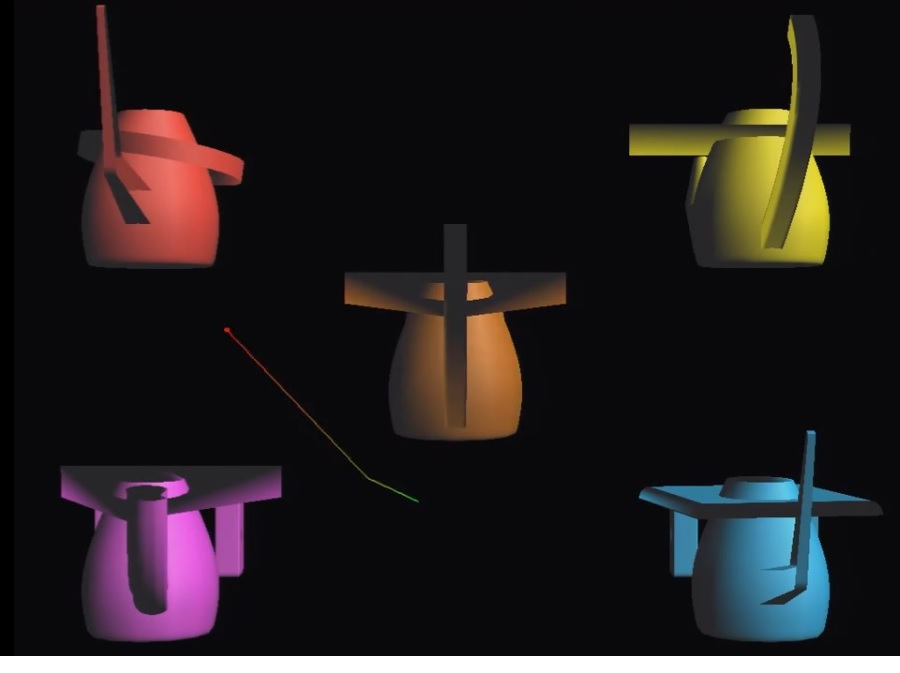

# ContingentEyeTracking-Talk2Tobii
Contingent Eye Tracking with 3D Objects
- Freebles are 3D objects that are manipulated according to eye-tracking data 
- The scripts are able to replay the stimulus along with the eye-tracking data accurately synchronised
- There is some code for the analysis of fixation and saccades
- The stimulus is designed to attract the attention of toddles 

    
     

## Puplications
- *F. Deligianni*, A. Senju, G. Gergely, and G. Csibra, Automated Gaze-Contingent Objects Elicit Orientation Following in 8-months-old infants, /Dev Psychol/, 47:1499-1503, 2011. 

